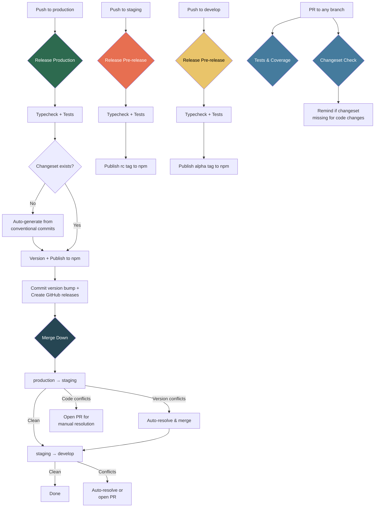

# Motor CMS Admin Frontend Template

Open-source Tier 1 layers for the Motor CMS admin frontend.

## Packages

| Package | Description |
|---------|-------------|
| `@motor-cms/ui-core` | Core infrastructure — grid, form, auth, i18n, stores, composables |
| `@motor-cms/ui-admin` | Admin UI — CRUD pages, rich text editor, navigation management |
| `@motor-cms/ui-media` | Media library — file browser, upload, image crop |

## Quick Start

```bash
pnpm install
pnpm dev        # starts playground dev server
pnpm test       # runs all unit tests
pnpm typecheck  # TypeScript check
```

## Usage

Install the layers in your Nuxt project:

```bash
pnpm add @motor-cms/ui-core @motor-cms/ui-admin @motor-cms/ui-media
```

Extend them in your `nuxt.config.ts`:

```ts
export default defineNuxtConfig({
  extends: [
    '@motor-cms/ui-core',
    '@motor-cms/ui-admin',
    '@motor-cms/ui-media'
  ]
})
```

## CI/CD Pipeline



### Branching Strategy

Code flows **develop → staging → production** for development. Version changes cascade back **production → staging → develop** automatically after release.

| Branch | npm tag | Purpose |
|--------|---------|---------|
| `production` | `latest` | Stable releases |
| `staging` | `rc` | Release candidates |
| `develop` | `alpha` | Development pre-releases |

## Development

See [AGENT.md](./AGENT.md) for detailed development instructions.

## License

MIT
